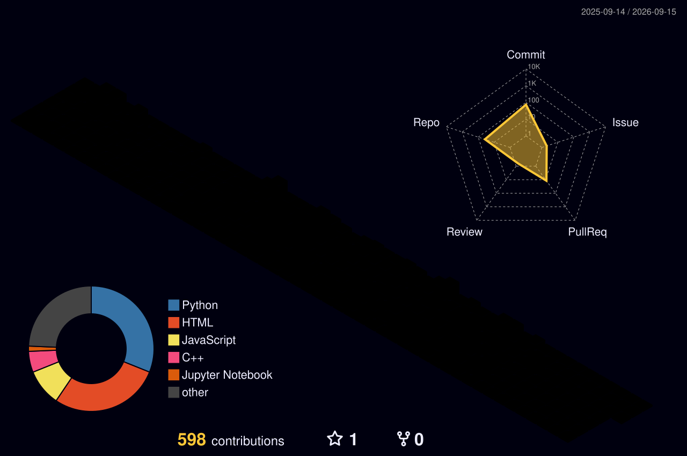

<!-- ========================================================= -->
<!--        NEHA PANDEY — GITHUB PROFILE README               -->
<!--   INSTRUCTIONS: Place this file at ne-ey/ne-ey/README.md -->
<!-- ========================================================= -->
<div align="center">
<!-- ANIMATED WAVE HEADER -->

<!-- TYPING SVG -->
Show Image
<br/>
<!-- BADGES ROW -->
Show Image
Show Image
Show Image
Show Image
</div>

🗺️ PLAYER CARD

```yaml
NAME   : Neha Pandey
HANDLE : @ne-ey
CLASS  : AI/ML Intern + C++ Enthusiast
GUILD  : IBM PBEL (AI/ML) · UCER Prayagraj
LEVEL  : 3rd Year B.Tech (AI/ML Spec.)
HP     : ████████████ 100%  
EXP    : ████████░░  200+ LC solved
SPEC   : RAG Systems · LangChain · FAISS
LOOT   : HF Supercontributor · GI Hackathon
STATUS : 🟢 ACTIVE — SEEKING NEW QUESTS
```
<br clear="right"/>

🎮 QUEST LOG — PROJECTS
<table>
<tr>
<td width="50%" valign="top">
🔮 Personal AI Knowledge Assistant

Difficulty: ★★★★☆  |  Class: AI/RAG

Show Image
Show Image
Show Image
Show Image
STATUS : ✅ LIVE IN PRODUCTION
BOSS   : AI Hallucinations → DEFEATED
LOOT   : Citation-backed answers
         High-precision semantic search
         Multi-PDF knowledge bases
Show Image
</td>
<td width="50%" valign="top">
🤖 AI-Powered Code Review Assistant

Difficulty: ★★★★★  |  Class: Backend+AI

Show Image
Show Image
Show Image
Show Image
STATUS : ✅ SHIPPED
BOSS   : Manual code review → AUTOMATED
LOOT   : Big-O complexity detection
         PR comments via GitHub API
         30% code quality boost
Show Image
</td>
</tr>
<tr>
<td width="50%" valign="top">
⚡ C++ Refactor API

Difficulty: ★★★★☆  |  Class: Systems/C++

Show Image
Show Image
Show Image
STATUS : ✅ OPTIMIZED
BOSS   : Slow static analysis → CRUSHED
LOOT   : Hot-path profiling
         STL-optimized pattern matching
         Real-time refactor suggestions
Show Image
</td>
<td width="50%" valign="top">
🌐 IBM PBEL — AI/ML Internship

Role: AI/ML Virtual Intern  |  Jun–Jul 2025

Show Image
Show Image
Show Image
STATUS : ✅ COMPLETED
BOSS   : Production ML pipelines → BUILT
LOOT   : Modular data pipelines
         Agile team delivery
         Unit testing & clean code
</td>
</tr>
</table>

⚙️ ARSENAL — TECH STACK
<div align="center">
[ LANGUAGES ]
Show Image
[ AI / ML ENGINE ]
Show Image
[ BACKEND & INFRA ]
Show Image
[ TOOLS ]
Show Image
</div>

⚔️ COMBAT LOG — DSA STATS
<div align="center">

```
⚔️  PROBLEMS SOLVED : 200+        🏹 RANK : Top 15%
🧠  SPECIALTIES     : DP · Graphs · Trees · Greedy
```
</div>

🏆 TROPHY ROOM
<div align="center">

</div>
🎖️ RARE DROPS
XPBadgeAchievement+5000🏅 Hacktoberfest 2025 Supercontributor6+ merged PRs across C++ & Python open source repos+4000🚀 Google India Girl Hackathon 2025Shortlisted — Top percentile, algorithmic design+3500⚔️ LeetCode Top 15%200+ problems, DP · Graphs · Trees · Greedy+4500🤖 IBM PBEL AI/ML InternReal ML pipelines, agile team, clean code delivery

🏅 HACKTOBERFEST 2025 — SUPERCONTRIBUTOR BOARD
<div align="center">
Show Image

Earned the Supercontributor badge (gold tier) + Contributor L0→L4 + Plant a Tree badge
by merging 6+ high-quality PRs to open source C++ & Python repos during Oct 2025

</div>

📡 ANALYTICS VAULT
<div align="center">


</div>

🌌 3D CONTRIBUTION CALENDAR

Auto-generated daily via GitHub Actions — Set it up

<div align="center">
<picture>
  <source media="(prefers-color-scheme: dark)"
    srcset="profile-3d-contrib/profile-night-rainbow.svg" />
  <source media="(prefers-color-scheme: light)"
    srcset="profile-3d-contrib/profile-south-season-animate.svg" />
  
</picture>
</div>

🐍 CONTRIBUTION SNAKE
<div align="center">
<picture>
  <source media="(prefers-color-scheme: dark)"
    srcset="https://raw.githubusercontent.com/ne-ey/ne-ey/output/github-snake-dark.svg" />
  <source media="(prefers-color-scheme: light)"
    srcset="https://raw.githubusercontent.com/ne-ey/ne-ey/output/github-snake.svg" />
  
</picture>
</div>

⚙️ SETUP GUIDE — ACTIVATE YOUR POWERS
<details>
<summary><b>🚀 Click to expand — How to make the 3D graph & Snake work</b></summary>
Step 1 — 3D Contribution Calendar

Copy .github/workflows/3d-contrib.yml into your ne-ey/ne-ey repo
Go to Settings → Actions → General → Workflow permissions → enable Read and write permissions
Run the workflow manually from Actions tab → GitHub-Profile-3D-Contrib → Run workflow
After it runs, a profile-3d-contrib/ folder will appear with your SVG files ✅

Step 2 — Snake Animation

Copy .github/workflows/snake.yml into your repo
Run the workflow manually from Actions tab → Generate Snake Animation → Run workflow
This creates an output branch with your snake SVGs ✅

Step 3 — LeetCode Card

Your username for leetcode.com must be ne-ey — update the URL if different

Step 4 — Holopin Badges

Already linked to https://holopin.me/ne-ey — this auto-renders your badge board! ✅

</details>

<div align="center">
<!-- QUOTE -->

"Programs must be written for people to read, and only incidentally for machines to execute."
— Hal Abelson

<br/>
<!-- FOOTER WAVE -->

</div>
